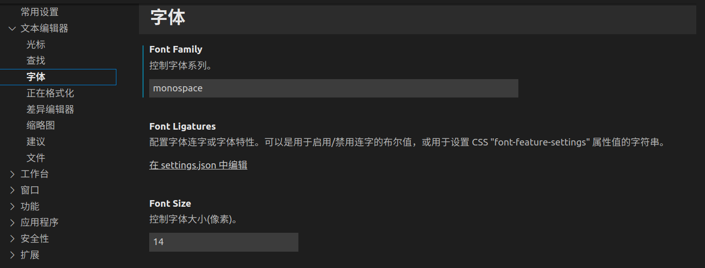
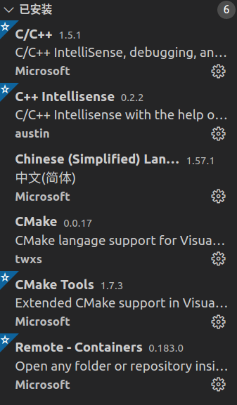
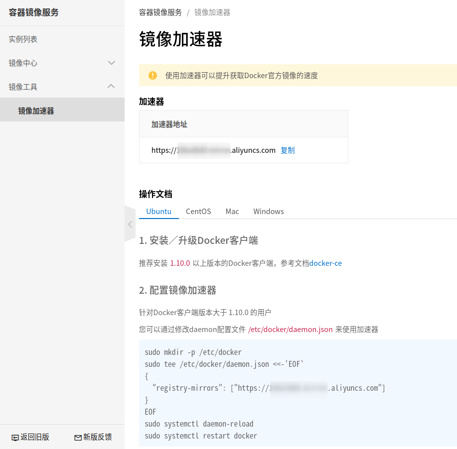
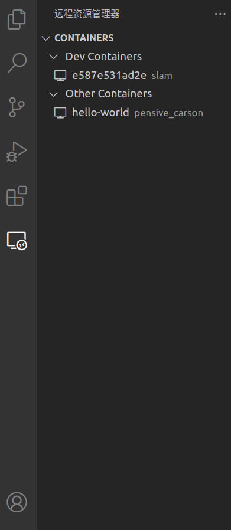
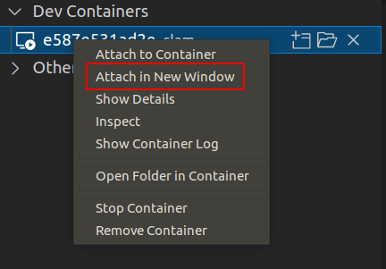
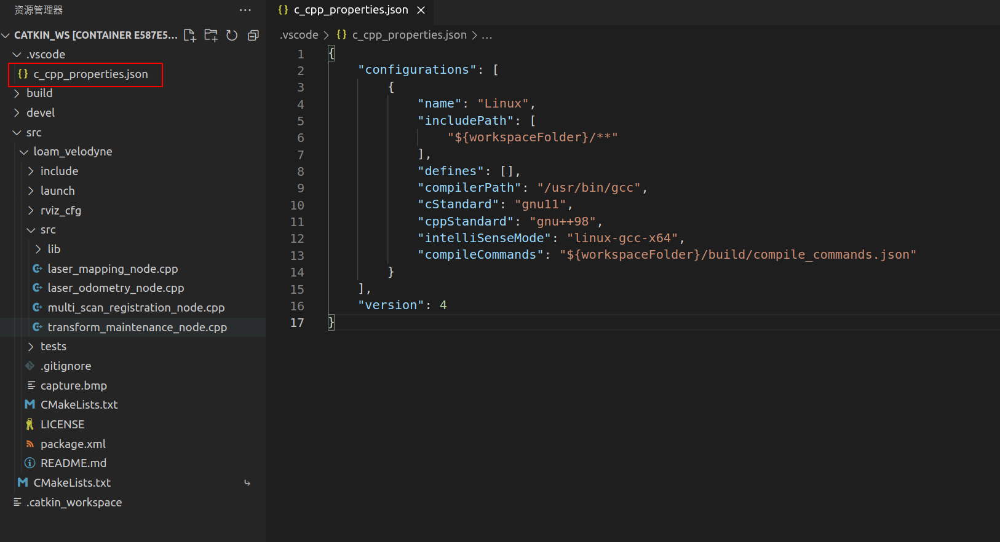

# VS Code && Docker环境配置

## VS Code配置

### 字体

推荐在VS Code中使用等宽字体(**monospace**)，这样便于阅读代码，不会因为字体原因难以阅读。
如下图：


### 插件推荐

这里主要推荐下面三类插件，第一类是C++相关，提供了语法高亮、本地跳转功能（编译生产文件依赖关系之后），第二类是CMake相关，提供CMake的语法高亮，第三类是汉化。注意：容器内和本机最好都装一遍，连接到docker里后，可以直接在插件目录点击搜索安装。

- C++
  + C/C++
  + C++ Intellisense
- CMake
  + CMake
  + CMake Tools
- zh
  + Chinese (Simplified) Language Pack for Visual Studio Code
- docker
  + Remote-Containers



## Docker配置

### 安装

先卸载旧版本（如果没有装可以跳过）

``` bash
sudo apt-get remove docker docker-engine docker.io containerd runc
```

安装前置软件

``` bash
sudo apt-get install apt-transport-https ca-certificates curl gnupg lsb-release
```

添加Docker官方GPG密钥

``` bash
curl -fsSL https://download.docker.com/linux/ubuntu/gpg | sudo gpg --dearmor -o /usr/share/keyrings/docker-archive-keyring.gpg
```

添加稳定版仓库

``` bash
sudo add-apt-repository "deb [arch=amd64] https://download.docker.com/linux/ubuntu bionic stable"
```

安装Docker

``` bash
sudo apt-get update
sudo apt-get install docker-ce docker-ce-cli containerd.io
```

使用国内镜像源加速（可选）

docker hub 中国镜像：https://registry.docker-cn.com
网易云docker hub加速：https://hub-mirror.c.163.com
阿里云个人镜像加速
查看以下链接[https://cr.console.aliyun.com/cn-hangzhou/instances/mirrors](https://cr.console.aliyun.com/cn-hangzhou/instances/mirrors)，如下图：



创建&&打开文件daemon.json
``` bash
sudo gedit /etc/docker/daemon.json
```
将下面的内容复制到里面
``` json
{
  "registry-mirrors": ["https://your link.mirror.aliyuncs.com"]
}
```

重启docker

``` bash
sudo systemctl daemon-reload
sudo systemctl restart docker
```

测试是否安装完毕

``` bash
sudo docker run hello-world
```
出现下列输出即可
``` bash
latest: Pulling from library/hello-world
b8dfde127a29: Pull complete 
Digest: sha256:df5f5184104426b65967e016ff2ac0bfcd44ad7899ca3bbcf8e44e4461491a9e
Status: Downloaded newer image for hello-world:latest

Hello from Docker!
This message shows that your installation appears to be working correctly.

To generate this message, Docker took the following steps:
 1. The Docker client contacted the Docker daemon.
 2. The Docker daemon pulled the "hello-world" image from the Docker Hub.
  (amd64)
 3. The Docker daemon created a new container from that image which runs the
  executable that produces the output you are currently reading.
 4. The Docker daemon streamed that output to the Docker client, which sent it
  to your terminal.

To try something more ambitious, you can run an Ubuntu container with:
 $ docker run -it ubuntu bash

Share images, automate workflows, and more with a free Docker ID:
 https://hub.docker.com/

For more examples and ideas, visit:
 https://docs.docker.com/get-started/
```

创建docker用户组并添加当前用户到docker用户组

``` bash
sudo groupadd docker
sudo usermod -aG docker ${USER}
sudo systemctl restart docker
```


### 创建及启动ros容器

从下面百度云链接中下载docker镜像文件

``` bash
├── ad_sensor_fusion.tar
├── docker_tar.sh
├── README.txt
└── run_docker.sh
```

[链接](https://pan.baidu.com/s/1r8NMjo4emt_jupOvUU1fHw)

提取码:2333

然后在终端中依次执行**docker_tar.sh**，**run_docker.sh**。

查看镜像ID

``` bash
docker image ls -a
```

输出如下。

``` bash
REPOSITORY         TAG                    IMAGE ID       CREATED        SIZE
ad_sensor_fusion   v1                     7e6ef2601daf   2 hours ago    5.72GB
osrf/ros           kinetic-desktop-full   e587e531ad2e   4 months ago   3.2GB
hello-world        latest                 d1165f221234   5 months ago   13.3kB
```

查看容器

``` bash
docker ps -a
```

输出为：

``` bash
CONTAINER ID   IMAGE                 COMMAND                  CREATED       STATUS                     PORTS     NAMES
fe44e9bdb563   ad_sensor_fusion:v1   "/bin/bash"              2 hours ago   Exited (134) 2 hours ago             ad_sensor_fusion
ee2beec23965   e587e531ad2e          "/ros_entrypoint.sh …"   13 days ago   Exited (0) 13 days ago               slam
```

启动容器

``` bash
# 注意替换自己的 container_name/container_id，使用docker ps -a查看
docker start ad_sensor_fusion
```

进入容器

``` bash
# 注意替换自己的 container_name/container_id，使用docker ps -a查看
docker container exec -it container_name/container_id /bin/bash
```

注意：使用**attach**参数也可，推荐**exec**。

``` bash
docker attach ad_sensor_fusion
```

## 使用VS Code工作

在安装了插件之后，我们可以在VS Code的左侧看到所有的容器，如下图



右键对应的容器，可以打开容器，这里我们选择在性窗口打开



使用cmake的参数生成文件依赖关系文件**compile_commands.json**

``` bash
catkin_make -DCMAKE_EXPORT_COMPILE_COMMANDS=Yes .
```

最后将上一步生成的文件指定为工程的配置关系文件，一般在上一步的编译完成后，打开工程里的C/C++源文件一会就会自动询问你是否使用**compile_commands.json**，这时候选择是即可，如果没有的话可以自己新建一个，这样配置之后，就可以右键或F12跳转函数了。



内容如下

``` json
{
    "configurations": [
        {
            "name": "Linux",
            "includePath": [
                "${workspaceFolder}/**"
            ],
            "defines": [],
            "compilerPath": "/usr/bin/gcc",
            "cStandard": "gnu11",
            "cppStandard": "gnu++98",
            "intelliSenseMode": "linux-gcc-x64",
            "compileCommands": "${workspaceFolder}/build/compile_commands.json"
        }
    ],
    "version": 4
}
```

此外，VS Code可以使用 Ctrl + “~”，打开终端直接进入container的命令行。