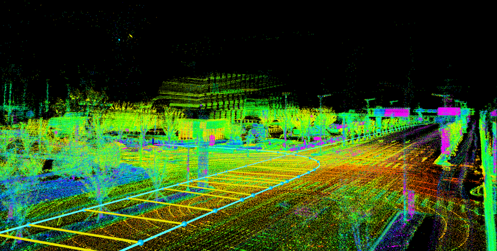
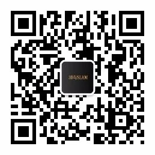
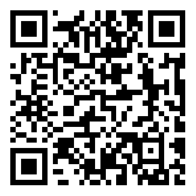

# 自动驾驶中的多传感器数据融合

本课程是3D视觉工坊的课程，《自动驾驶中的多传感器数据融合》课程主要分两个大模块：理论篇和实战篇，主要由两位知名自动驾驶公司算法人员教授。理论篇部分主要介绍自动驾驶中常用的传感器硬件、传感器间的时间同步和空间同步以及多传感器间的信息融合理论知识；实战篇更多偏向工程应用，工程中传感器间同步与融合如何实现等，课程大纲如下：

注意：实践部分将提供所有实现代码和数据！

## 课程目录

理论篇		

- 常用传感器硬件介绍
- 多传感器同步理论
- 多传感器信息融合理论（上）
- 多传感器信息融合理论（下）

实战篇（代码）		

- 实战基础
  + 2D-3D求解方法（PnP系列）
    - 2D-3D原理推导
    - 2D-3D求解实现(代码)
  + 点云去畸变与对齐实战
    - 直接匹配方法（基于SVD，基于优化）
    - 基于ICP的点云去畸变与对齐（代码）
  + KF与EKF
    - KF
    - EKF
- 传感器间同步实战
  + 多相机间的同步实战
    - 时间同步
      + 时间直接配准法
    - 空间同步
      + 多相机极线对齐
  + 相机与IMU间的同步实战
    - 时间同步与空间同步
      + 基于中心差分卡尔曼滤波的时间与空间同步
  + 相机与LiDAR间的同步实战
    - 时间同步
      + 基于内插外推法的时间同步
    - 空间同步
      + 静态联合标定（PnP）
  + LiDAR与IMU间的同步实战
    - 时间同步与空间同步
      + 基于状态估计的时空同步
  + 相机与Radar间的同步实战
    - 空间同步
      + 静态联合标定
- 传感器间信息融合实战
  + 多相机间的信息融合
    - 双目测距
  + 相机与IMU间的信息融合
    - 视觉SLAM与IMU融合
  + 相机与LiDAR间的信息融合
    - 基于图像与点云的深度信息融合
  + 相机与Radar间的信息融合
    - 基于EKF的单目与Radar的目标级融合
  + LiDAR与IMU间的信息融合
    - 基于SLAM的LiDAR和IMU信息融合
  + LiDAR与Radar间的信息融合
    - 基于EKF的LiDAR与Radar的目标级融合

公众号二维码：

[课程二维码](https://lgo.h5.xeknow.com/s/1cYByE)：

